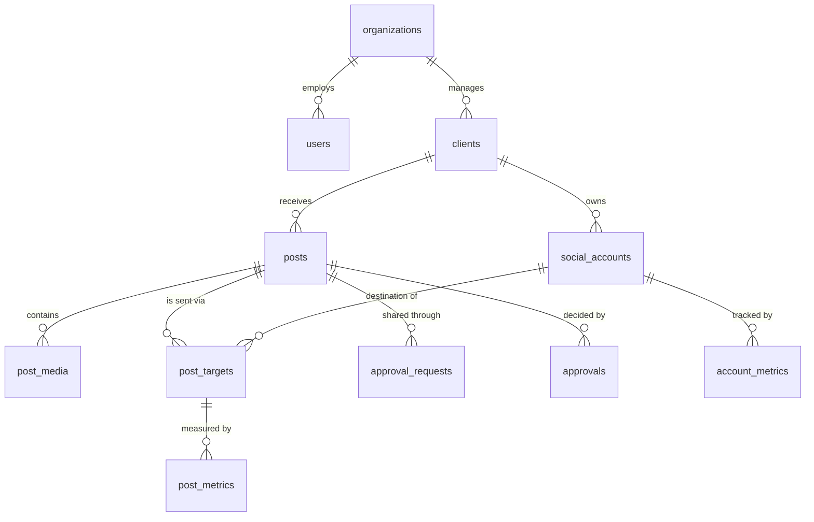

# Slate database schema

Plain-language reference for what's in the database and why. The actual
definition lives in [`server/migrations/001_initial_schema.sql`](../server/migrations/001_initial_schema.sql),
which is heavily commented — this document is the overview.

## How it fits together



Read it as a sentence: *your agency* manages *clients*, each client owns
*social accounts*, you write *posts* for a client, each post goes out through
one or more *targets* (one per account), and metrics are collected against
those targets.

## The tables

| Table | What it holds |
| ----- | ------------- |
| `organizations` | One row per agency. Right now, just yours. |
| `users` | Your team members and their role (`owner` / `admin` / `member`). |
| `clients` | The brands you manage, plus the contact you send approvals to. |
| `social_accounts` | Connected Instagram / Facebook accounts and their access tokens. |
| `posts` | The content — caption, media, when it's scheduled, where it is in the approval flow. |
| `post_media` | Images and videos attached to a post, in carousel order. |
| `post_targets` | One row per (post, account): where it's going and how that went. |
| `approval_requests` | The private approval links you send to clients. |
| `approvals` | What the client actually decided, and when. |
| `post_metrics` | Performance snapshots for a published post over time. |
| `account_metrics` | Follower counts and reach, one row per account per day. |
| `schema_migrations` | Bookkeeping: which migration files have been applied. |

## The post workflow

```
draft ──> pending_approval ──┬──> changes_requested ──> (back to draft)
                             │
                             └──> approved ──> scheduled ──> published
                                                         └─> failed

archived is a dead end reachable from anywhere.
```

Once publishing runs, `posts.status` is a summary and `post_targets.status`
is the truth:

| Targets | `posts.status` becomes |
| ------- | ---------------------- |
| all published | `published` |
| all failed | `failed` |
| some of each | `published` — check the targets for detail |

## Decisions worth knowing about

**One post can go to several accounts.** The caption and media are stored once
on `posts`; `post_targets` records each destination separately. This matters
because Instagram can fail while Facebook succeeds — a single status field on
the post could not represent that, and you'd have no way to retry just the
failed half. This is verified behaviour, not theory: the schema test walks a
post through exactly that partial failure.

**Approval link tokens are stored hashed, never in plain text.** Same principle
as passwords. The raw token exists only in the URL you send the client. If the
database were ever exposed, the stored hashes could not be turned back into
working approval links. Links also *must* have an expiry — the column is
`not null` — because an approval link that works forever is a liability once
it's been forwarded around a client's inbox.

**Access tokens are stored encrypted.** The column is called
`access_token_encrypted` so that writing a raw token into it looks obviously
wrong. The encryption itself arrives in phase 3, alongside the OAuth callback
that first obtains a token.

**Every table carries `organization_id`.** Only your agency uses Slate today,
but adding this column later — once there's real data — would mean touching
every table and every query. Adding it now costs one column.

**Scheduling stores both an absolute time and a timezone.** `scheduled_at` is
the exact moment the post fires. The separate `timezone` column records which
zone you composed it in, so the calendar can still say "9:00 AM Sydney" months
later and be right across daylight-saving changes.

**Deleting a client deletes everything beneath it** — its accounts, posts,
media, targets, approvals and metrics — but leaves your organization and users
untouched. Verified by test.

**The database is closed to the public internet.** Supabase automatically
publishes every table in the `public` schema as a REST API reachable with the
"anon" key, and that key is not secret — it ships inside the frontend where
anyone can read it. Every table has Row Level Security enabled with no
policies defined, which means those public roles can read and write exactly
nothing. The service role key our backend uses bypasses RLS, so the API keeps
full access and remains the only route to this data.

## Changing the schema later

Never edit a migration that has already been applied — the runner stores a
fingerprint of each file and will refuse to continue if one changes, because
at that point the database and the file no longer agree.

To make a change, add a new numbered file:

```sql
-- server/migrations/002_add_post_tags.sql
alter table posts add column tags text[] not null default '{}';
```

Then run `npm run migrate`. It applies only what's new.
